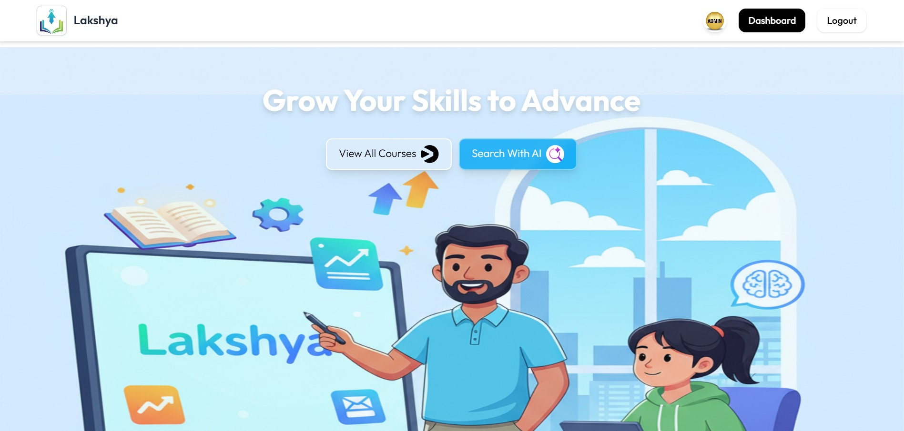
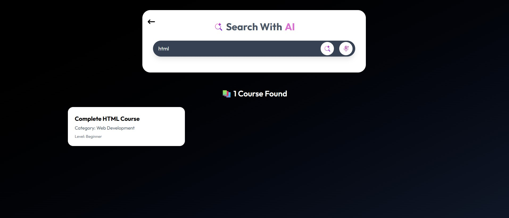
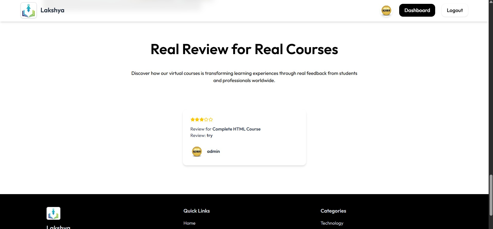
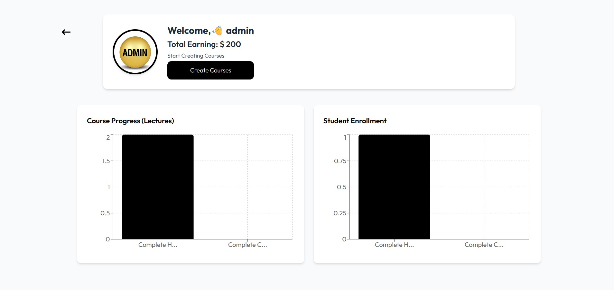
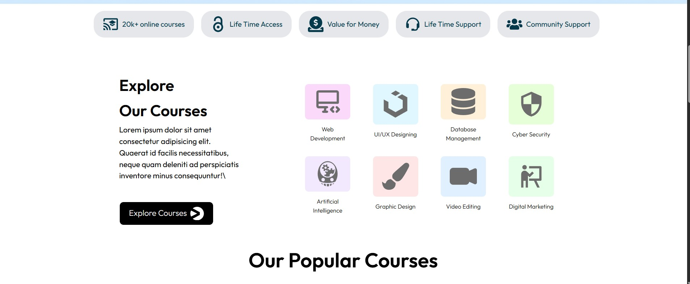

# 🎯 LAKSHYA – AI Integrated LMS

LAKSHYA is an AI-powered Learning Management System (LMS) built using the **MERN Stack** (MongoDB, Express, React, Node.js). It’s designed to provide a seamless, intelligent, and interactive learning experience for both students and instructors, integrating advanced AI tools and modern web technologies.

---

## 🚀 Key Features

- **🧠 AI-Powered Smart Search**  
  Find courses and content instantly with AI-enhanced search and recommendations using **Gemini API**.

- **🔐 Google Authentication**  
  Secure login and signup powered by **Google OAuth** for quick and trusted access.

- **💳 Razorpay Payment Gateway**  
  Integrated payment system for smooth and secure course purchases.

- **⚛️ Redux Toolkit for State Management**  
  Efficient and scalable state handling across the entire application.

- **📚 Student & Instructor Dashboards**  
  Separate, feature-rich dashboards for learners and educators to manage courses, progress, and analytics.

- **🖥️ Fully Responsive Design**  
  Optimized for all devices — from desktops to smartphones.

---

## 🧩 Tech Stack

| Component      | Technology                          |
|----------------|-------------------------------------|
| **Frontend**   | React.js, Redux Toolkit, Tailwind CSS |
| **Backend**    | Node.js, Express.js                 |
| **Database**   | MongoDB                             |
| **Auth**       | Google OAuth                        |
| **Payment**    | Razorpay                            |
| **AI**         | Gemini API                          |

---

## 🖼️ Screenshots

Here are some screenshots from the application:

### 1. Home Page
  
*Landing page showcasing available courses.*

### 2. Search with AI
  
*AI-powered course search interface with smart filtering.*

### 3. Course Listing Page
  
*Browse and filter courses by various categories.*

### 4. Reviews Page
  
*Real feedback and ratings from learners worldwide.*

### 5. Admin Dashboard
  
*Instructor dashboard with analytics, earnings, and course management.*

### 6. Hero Section
  
*Main banner showcasing course categories and features.*

